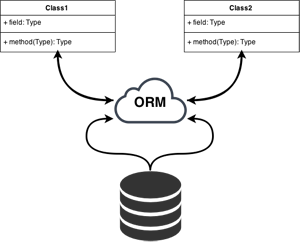

# Prework

## Recuerda

**¿Qué es la arquitectura cliente-servidor?**

Esta arquitectura de aplicación divide un sistema en dos componentes:

- **Cliente**: Es un programa o proceso que solicita un servicio y usa la información provista para sus propios objetivos.
- **Servidor**: Programa o proceso que ofrece un conjunto de servicios y espera por peticiones para ejecutar o dar estos servicios.

La principal característica de la arquitectura cliente-servidor es que logra una s**eparación de responsabilidades clara.**

### **Separación clara de responsabilidades**

La funcionalidad del sistema se divide en **dos partes** (por lo menos), como el nombre lo indica en parte de dar los **servicios** (generalmente de datos) y la parte de atender al **usuario** (humanos o programa) final.

El cliente y el servidor tienen funciones completamente distintas y cada uno puede cambiar por su lado sin afectar al otro, a esto le podemos llamar “evolución independiente”.

El ejemplo que tenemos es el del navegador y las páginas que visitamos normalmente en internet. Mientras sigan cumpliendo con el protocolo establecido de comunicación (HTTP) van a poder seguir comunicándose y transfiriendo información, sin interferir la manera en que estén implementados sus procesos internos.


## Métodos de petición HTTP

HTTP define un **conjunto de métodos** de petición para indicar la acción que se desea realizar para un recurso determinado. Aunque estos también pueden ser sustantivos, estos métodos de solicitud a veces son llamados **HTTP verbs**.

- **[GET](https://developer.mozilla.org/en-US/docs/Web/HTTP/Methods/GET)**
El método GET solicita una representación de un recurso específico. Las peticiones que usan el método GET sólo deben recuperar datos.
- **[HEAD](https://developer.mozilla.org/en-US/docs/Web/HTTP/Methods/HEAD)**
El método HEAD pide una respuesta idéntica a la de una petición GET, pero sin el cuerpo de la respuesta.
- **[POST](https://developer.mozilla.org/en-US/docs/Web/HTTP/Methods/POST)**
El método POST se utiliza para enviar una entidad a un recurso en específico, causando a menudo un cambio en el estado o efectos secundarios en el servidor.
- **[PUT](https://developer.mozilla.org/en-US/docs/Web/HTTP/Methods/PUT)**
El modo PUT reemplaza todas las representaciones actuales del recurso de destino con la carga útil de la petición.
- **[DELETE](https://developer.mozilla.org/en-US/docs/Web/HTTP/Methods/DELETE)**
El método DELETE borra un recurso en específico.
- **[CONNECT](https://developer.mozilla.org/en-US/docs/Web/HTTP/Methods/CONNECT)**
El método CONNECT establece un túnel hacia el servidor identificado por el recurso.
- **[OPTIONS](https://developer.mozilla.org/en-US/docs/Web/HTTP/Methods/OPTIONS)**
El método OPTIONS es utilizado para describir las opciones de comunicación para el recurso de destino.
- **[TRACE](https://developer.mozilla.org/en-US/docs/Web/HTTP/Methods/TRACE)**
El método TRACE realiza una prueba de bucle de retorno de mensaje a lo largo de la ruta al recurso de destino.
- **[PATCH](https://developer.mozilla.org/en-US/docs/Web/HTTP/Methods/PATCH)**
El método PATCH es utilizado para aplicar modificaciones parciales a un recurso.


## ¿Qué es **SQL?**

**SQL -siglas de Structured Query Language**, es el lenguaje de consultas a bases de datos, que nos permitirá crear, modificar, consultar y eliminar tanto bases de datos como sus tablas y registros.
Como todo lenguaje informático, posee su propia **sintaxis, tipos de datos y elementos.**

## Consultas SQL

Las consultas SQL son las operaciones más comunes y esenciales del lenguaje SQL. A través de una consulta SQL, se puede buscar en la base de datos para obtener la información necesaria.

| Cláusula SQL  | Función | Obligatorio |
| :--: | :--: | :--: |
| SELECT | Muestra una lista de los campos que contienen datos de interés. | Sí |
| FROM | Muestra las tablas que contienen los campos de la cláusula SELECT. | Sí |
| WHERE | Especifica los criterios de campo que cada registro debe cumplir para poder ser incluido en los resultados. | NO |

## Elementos del lenguaje SQL

El lenguaje SQL se basa en varios elementos.

Para la comodidad de los desarrolladores de SQL todos los comandos del lenguaje necesarios en los correspondientes sistemas de gestión de bases se ejecutan a través de una **interfaz específica de línea de comandos SQL** (command-line interface o CLI).
+ **Cláusulas**: las cláusulas son componentes de los estados y las querys.
+ **Expresiones**: las expresiones pueden producir valores escalares o tablas, que consisten en columnas y filas de datos.
+ **Predicados**: que especifican las condiciones que se utilizan para limitar los efectos de los comandos y las consultas, o para cambiar el flujo del programa.
+ **Querys**: una query o consulta va a recuperar los datos, en base a un criterio dado.
+ **Comandos**: con los comandos puedes controlar las operaciones, el flujo del programa, conexiones, sesiones, o diagnósticos.

## **Fundamentos de SQL**

Con SQL podemos realizar diferentes operaciones para consultar o manipular datos. A estas operaciones solemos referirnos como operaciones CRUD (de Create, Read, Update y Delete). Para ello hacemos uso de cuatro instrucciones para realizar estas tareas:

- `INSERT`: inserta filas en una tabla. Se corresponde con la “C” de CRUD.
- `SELECT`: Muestra información sobre los datos almacenados en la base de datos. Dicha información puede pertenecer a una o varias tablas. Es la “R”.
- `UPDATE`: Actualiza información de una tabla. Es, obviamente, la “U”.
- `DELETE`: Borra filas de una tabla. Se corresponde con la “D”.

>💡 **Nota**
>
>Hay dos enfoques para interactuar con una base de datos:
>
>Usar el l**enguaje de consulta nativo** de las bases de datos (por ejemplo, SQL)
>Uso de un **modelo de datos de objetos** ("ODM") / **modelo relacional de objetos** ("ORM"). Un ODM / ORM representa los datos del sitio web como objetos JavaScript, que luego se asignan a la base de datos subyacente. Algunos ORM están vinculados a una base de datos específica, mientras que otros proporcionan un backend independiente de la base de datos.

## **DDL, DML y DCL**

Cuando pensamos en una base de datos tenemos solemos verla como un conjunto de datos ordenados en tablas, registros e índices pero en realidad el primer paso es definir sus estructuras de datos. El lenguaje SQL permite a programadores realizar esta tarea de manera eficiente a través de un gestor de bases de datos como MySQL o PostgreSQL. Para ello SQL como estándar se estructura a su vez en 3 lenguajes independientes con las siglas **DDL, DML y DCL**.

### **Lenguaje de Definición de Datos**

DDL (Data Definition Language) es el conjunto de instrucciones agrupadas en un lenguaje que nos permite definir estas estructuras que almacenarán los datos así como los procedimientos y funciones que permitirán consultarlos.

Para definir las estructura disponemos de tres sentencias:

- CREATE, se usa para crear una base de datos, tabla, vistas, etc.
- ALTER, se utiliza para modificar la estructura, por ejemplo añadir o borrar columnas de una tabla.
- DROP, con esta sentencia, podemos eliminar los objetos de la estructura, por ejemplo un índice o una secuencia.

### **Lenguaje de Manipulación de Datos (DML)**

Data Manipulation Language (DML) se resume en el conjunto de instrucciones SQL que permite a los usuarios introducir datos para posteriormente realizar tareas de consultas o modificación de los datos que contienen las Bases de Datos.

Los elementos que se utilizan para manipular los datos, son los siguientes:

- SELECT, esta sentencia se utiliza para realizar consultas sobre los datos.
- INSERT, con esta instrucción podemos insertar los valores en una base de datos.
- UPDATE, sirve para modificar los valores de uno o varios registros.
- DELETE, se utiliza para eliminar las finas de una tabla

### **Lenguaje de Control de Datos (DCL)**

Hasta aquí hemos visto las sentencias usadas para crear y manipular datos pero también es necesario su control y administración. De esto se encarga el lenguaje DLC (Data Control Languaje) mediante el conjunto de comandos que permiten a un administrador del sistema de bases de datos controlar el acceso a usuarios mediante la asignación de permisos o roles para realizar determinadas tareas.

Los comandos para controlar los permisos son los siguientes:

- GRANT, permite otorgar permisos.
- REVOKE, elimina los permisos que previamente se han concedido.

## ¿Qué es un ORM?

Un ORM te permite convertir los datos de tus objectos en un formato correcto para poder guardar la información en una base de datos (**mapeo**) creándose una **base de datos virtual** donde los datos que se encuentran en nuestra aplicación, quedan **vinculados** a la base de datos (**persistencia**).

Si alguna vez has programado alguna aplicación que se conecta a una base de datos, habrás podido comprobar lo laborioso que es transformar toda la información que recibes de la base datos, principalmente en tablas, en los objetos de tu aplicación y viceversa. A ésto se le denomina **mapeo**.

Utilizando un ORM este mapeo será automático, es más, será **independiente** de la base de datos que estés utilizando en ese momento pudiendo cambiar de motor de base de datos según tus necesidades.Veamos un ejemplo. Supongamos que tenemos una tabla de clientes. En nuestra aplicación queremos hacer las funciones básicas sobre base de datos **CRUD** (del inglés Create, Read, Update and Delete) Crear, Obtener, Actualizar y Borrar. Cada operación corresponde con una sentencia SQL.



## ¿Qué es un ODM?

MongoDB expresa los datos que se guardarán en un formato similar a JSON y los guarda como un documento. La función de asociar tal documento con un objeto en un lenguaje de programación se llama Object-Document Mapper.

Dado que los documentos MongoDB son formatos similares a JSON, es posible tener una estructura jerárquica (anidada).

Ej:

```json
{
    "name": "John Smith",
    "age": 20,
    "email": "foo@example.com"
}
```

### Resumen

**ORM** o Object-Relational Mapper mapea objetos a registros de **bases de datos relacionales** (también conocidas como relaciones, de ahí el nombre). Oracle, MySQL y PostgreSQL son bases de datos relacionales muy conocidas.

**ODM** o Object-Document Mapper hace lo mismo para **bases de datos no relacionales**, basadas en documentos como MongoDB: mapeará objetos a documentos.

En ambos casos, la idea es hacer que la persistencia de objetos en una aplicación orientada a objetos sea lo más simple y transparente posible, sea cual sea el tipo de sistema de base de datos de destino que esté utilizando para esa persistencia.
